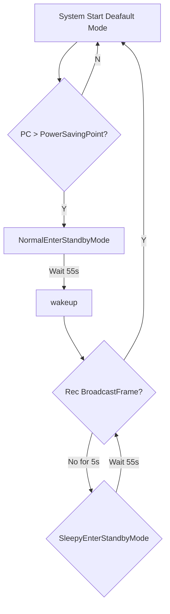

```mermaid
flowchart

A[System Start Deafault Mode] --> B{PC > PowerSavingPoint?}
B --> |Y|C[NormalEnterStandbyMode]
B --> |N|A
C --> |Wait 55s|D[wakeup]
D --> E{Rec BroadcastFrame?}
E --> |Y|A
E --> |No for 5s|F{SleepyEnterStandbyMode}
F --> |Wait 55s|E{Rec BroadcastFrame?}

```