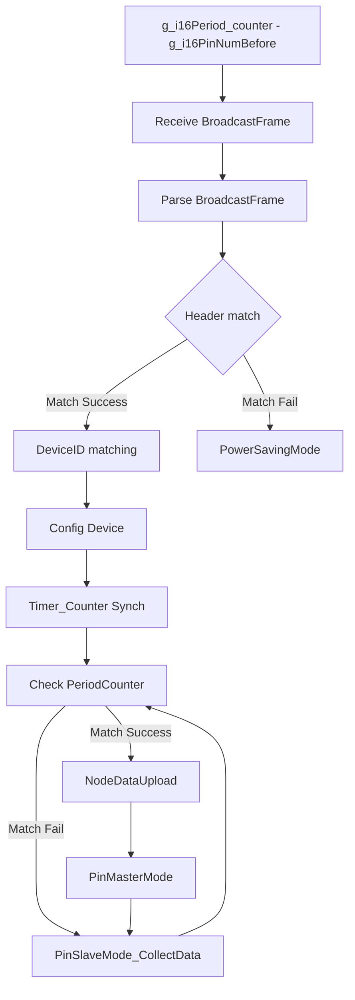

```mermaid
flowchart
A[g_i16Period_counter - g_i16PinNumBefore] --> B[Receive BroadcastFrame] --> C[Parse BroadcastFrame] --> D{Header match}
D --> |Match Success|E[DeviceID matching]
D --> |Match Fail|F[PowerSavingMode]
E --> G[Config Device] --> H[Timer_Counter Synch] --> I[Check PeriodCounter]
I --> |Match Success|J[NodeDataUpload]
I --> |Match Fail|K[PinSlaveMode_CollectData] --> I
J --> L[PinMasterMode] --> K
```