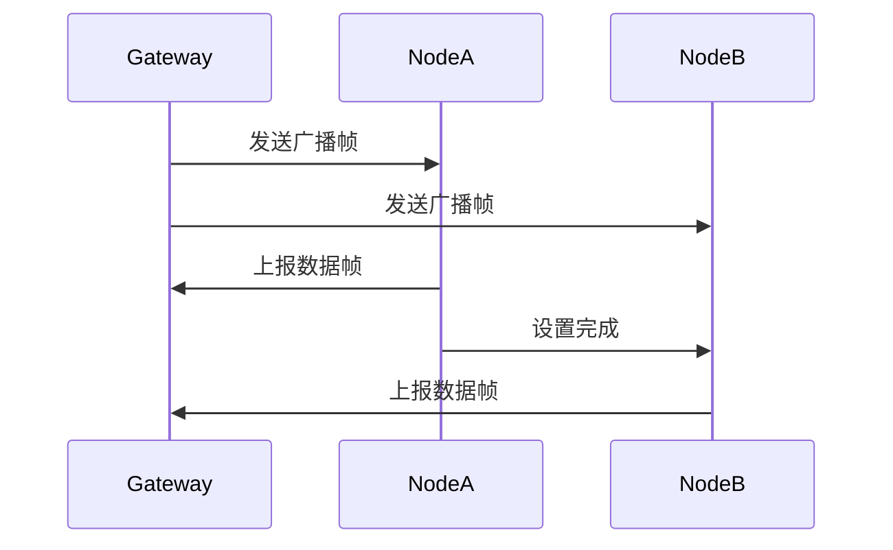
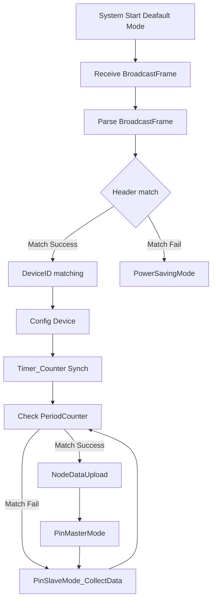

# sequenceDiagram

```mermaid
---
displayMode: compact
---
gantt
    title 通讯甘特图
    dateFormat SSS
    axisFormat %L

    section 网关
    广播帧:1, 000, 30ms
    接收数据帧:1, 005, 5ms
    接收数据帧:1, 445, 5ms
    接收数据帧:1, 525, 5ms
    接收数据帧:1, 725, 5ms
    接收数据帧:1, 845, 5ms

    section A01
    接收并解析:1, 005, 10ms
    pin1:2, 005, 40ms
    数据上报:1, 005, 30ms
    pin2:2, 045, 40ms
    pin3:2, 085, 40ms
    pin4:2, 125, 40ms
    pin5:2, 165, 40ms
    pin6:2, 205, 40ms
    pin7:2, 245, 40ms
    pin8:2, 285, 40ms
    pin9:2, 325, 40ms
    pin10:2, 365, 40ms
    pin11:2, 405, 40ms

    section B01
    接收并解析:1, 005, 10ms
    pin12:2, 445, 40ms
    数据上报:1, 445, 5ms
    pin13:2, 485, 40ms

    section C01
    接收并解析:1, 005, 10ms
    pin14:2, 525, 40ms
    数据上报:1, 525, 5ms
    pin15:2, 565, 40ms
    pin16:2, 605, 40ms
    pin17:2, 645, 40ms
    pin18:2, 685, 40ms

    section D01
    接收并解析:1, 005, 10ms
    pin19:2, 725, 40ms
    数据上报:1, 725, 5ms
    pin20:2, 765, 40ms
    pin21:2, 805, 40ms

    section E01
    接收并解析:1, 005, 10ms
    数据上报:1, 845, 5ms
    pin22:2, 845, 40ms
    pin23:2, 885, 40ms
    pin24:2, 925, 40ms
    pin25:2, 965, 40ms
```

# sequenceDiagram

```mermaid
sequenceDiagram

participant Gateway
participant NodeA
participant NodeB

Gateway->>NodeA: 发送广播帧
Gateway->>NodeB: 发送广播帧
NodeA->>Gateway: 上报数据帧
NodeA->>NodeB: 设置完成
NodeB->>Gateway: 上报数据帧
```

# System Flowchart

```mermaid
flowchart
A[System Start Deafault Mode] --> B[Receive BroadcastFrame] --> C[Parse BroadcastFrame] --> D{Header match}
D --> |Match Success|E[DeviceID matching]
D --> |Match Fail|F[PowerSavingMode]
E --> G[Config Device] --> H[Timer_Counter Synch] --> I[Check PeriodCounter]
I --> |Match Success|J[NodeDataUpload]
I --> |Match Fail|K[PinSlaveMode_CollectData] --> I
J --> L[PinMasterMode] --> K
```

