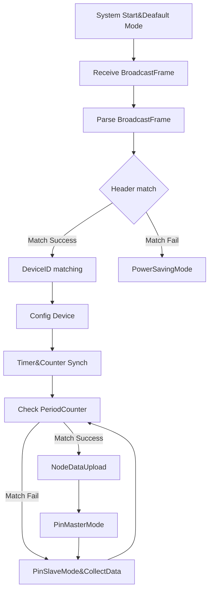

# 网关开发

## 已实现的功能

1. 定时自动发送通断广播帧
2. 定时自动发送阻抗广播帧
3. 长按按键切换广播帧类型
4. 接受数据帧并转发到串口

# 节点开发

## 已实现的功能

1. 通过lora接受广播帧和发送数据帧
2. 多个线束的通断检测
3. 多个线束的阻抗检测
4. 可由广播帧远程配置节点的检测模式，包括检测系统中节点的数量和线束的数量

## TODO

## 使用到的外设

### ADC

ADC（模数转换器）在本项目中被使用，用于检测在两个节点中检测线束的阻抗值。配置方法是轮循。

### DMA

DMA（直接内存访问）用于本项目中的数据传输到串口，原因是本项目实时性要求较高，使用轮循发送将有可能导致传输失败，或者造成其余中断异常

### EXTI

EXTI（外部中断）用于在本项目中进行线束通断检测，GD32F470VK共有22个外部中断，目前使用12个外部中断接受外部高电平中断实现通断检测

### I2C

I2C在本项目中被使用，并用来与端口扩展器XL9555进行通讯

### PMU

PMU在本项目中被用来对芯片进行能耗控制，设计睡眠模式，因为本项目是使用电池的系统，对续航敏感

### TIMER

定时器在本项目中被启用，并作为系统时间同步的关键

### USART

串口DMA发送和串口中断接受在本项目中被使用，并用来作为收发的关键

### USB

USB将被使用，目前还未开发

### RTOS

有可能会是使用到实时操作系统，需要进行适配

## 过程记录

### 扩展电路开发

首先要做的是对扩展电路进行验证

### 新增拨码开关控制频段功能


### 多任务系统移植
#### 移植记录
- 移植EXTI done
- 移植帧解析 done
- 移植通断检测 done
- 发送一次广播帧，持续检测五次 done
- 由开发板接口转为工程板接口 done
- 通断测试 done
    实际上，仍旧被中断优先级所影响，串口中断为0，EXTI为1，定时器为2，后续还需要验证和优化

- 针对工程中所使用到的所有FLAG，应统一更改为RTOS中的信号量方式 done
- 移植I2C
    I2C中断移植失败，I2C中断似乎与多任务系统有冲突，如果更改为轮询系统，理论上是可行的，且可操作性更高，本系统中的I2C没有高响应要求
    仍然采用I2C中断，但不采用信号量传递系统，系统正常，但收发功能受到影响
- 将晶振频率切换为240M
    切换后，经过测试，晶振频率是120M，目前不知为何有分频现象

#### 移植结论
在移植完通断检测并且增加IIC功能后，系统出现了异常，经过长时间的测试，系统的同步性能大幅下降，无法满足项目对实时性的要求，故终止FreeRTOS移植
### 通讯开发

随着指令增多，轮循发送的函数可能会出现问题，后续仍旧需要解决串口5 DMA发送的问题

#### 新增通讯超时判断

连续五次未接受到广播帧即代表通讯超时，停止检测功能，进入待机模式

#### 新增命令时隙

在第一个时隙前新增一个空闲时隙，用作上位机指令发送时隙

#### 新增入网回复

在指令帧时隙进行入网回复，按照协议发送入网回复帧；当设备进入待机模式后，下一次接收到广播帧，再次发送入网回复

#### 新增调试用上位机

##### 串口调试助手

用python自编一个串口调试助手

- 将接受到的每个字节保存为十六进制字符串，存储在txt文件中，因技术受限，仅做行切换

```python
import tkinter as tk
from tkinter import ttk
import serial
import serial.tools.list_ports
import threading
import binascii

class SerialDebugAssistant:
    def __init__(self, root):
        self.root = root
        self.root.title("Serial Debug Assistant")

        # Serial Port Configuration
        self.serial_ports = ttk.Combobox(root, values=self.get_available_ports())
        self.serial_port_label = tk.Label(root, text="Serial Port:")
        self.baud_rate_label = tk.Label(root, text="Baud Rate:")
        self.baud_rate = ttk.Combobox(root, values=["9600", "115200"])
        self.connect_button = tk.Button(root, text="Connect", command=self.connect_serial)

        # Text Area for Displaying Data
        self.text_area = tk.Text(root, state="disabled", wrap="word", height=10, width=50)
        self.scrollbar = tk.Scrollbar(root, command=self.text_area.yview)
        self.text_area.config(yscrollcommand=self.scrollbar.set)

        # Entry for User Input
        self.input_entry = tk.Entry(root, width=40)
        self.send_button = tk.Button(root, text="Send", command=self.send_data)

        # Layout
        self.serial_port_label.grid(row=0, column=0, padx=5, pady=5)
        self.serial_ports.grid(row=0, column=1, padx=5, pady=5)
        self.baud_rate_label.grid(row=0, column=2, padx=5, pady=5)
        self.baud_rate.grid(row=0, column=3, padx=5, pady=5)
        self.connect_button.grid(row=0, column=4, padx=5, pady=5)

        self.text_area.grid(row=1, column=0, columnspan=5, padx=5, pady=5)
        self.scrollbar.grid(row=1, column=5, sticky="ns")

        self.input_entry.grid(row=2, column=0, columnspan=3, padx=5, pady=5)
        self.send_button.grid(row=2, column=3, columnspan=2, padx=5, pady=5)

        # Serial Port Object
        self.ser = None

    def get_available_ports(self):
        ports = [port.device for port in serial.tools.list_ports.comports()]
        return ports

    def connect_serial(self):
        port = self.serial_ports.get()
        baud_rate = int(self.baud_rate.get())

        try:
            self.ser = serial.Serial(port, baud_rate, timeout=1)
            self.text_area.config(state="normal")
            self.text_area.insert(tk.END, f"Connected to {port} at {baud_rate} baud\n")
            self.text_area.config(state="disabled")

            # Start a separate thread for reading from the serial port
            read_thread = threading.Thread(target=self.read_from_serial)
            read_thread.start()
        except serial.SerialException as e:
            self.text_area.config(state="normal")
            self.text_area.insert(tk.END, f"Error: {str(e)}\n")
            self.text_area.config(state="disabled")

    def read_from_serial(self):
        with open('received_data.txt', 'a') as file:
            while True:
                data = self.ser.readline()
                if data:
                    hex_data = ' '.join(format(byte, '02X') for byte in data)

                    # Check if 'A5' is in the data
                    if 'A5' in hex_data:
                        hex_data = hex_data.replace('A5', '\nA5')
                        
                    file.write(f"{hex_data}\n")
                    file.flush()  # 立即刷新到磁盘


    def send_data(self):
        data = self.input_entry.get()
        if self.ser and self.ser.is_open:
            self.ser.write(data.encode('utf-8'))
            self.text_area.config(state="normal")
            self.text_area.insert(tk.END, f"Sent: {data}\n")
            self.text_area.config(state="disabled")

if __name__ == "__main__":
    root = tk.Tk()
    app = SerialDebugAssistant(root)
    root.mainloop()
```

- 增加时间戳

##### 数据解析绘图

- 将txt中的数据解析并绘制为电压-时间曲线

```python
import matplotlib.pyplot as plt

# 读取日志文件
with open('received_data.txt', 'r') as file:
    lines = file.readlines()

# 处理数据
data = []
for line in lines:
    fields = line.split()
    if len(fields) >= 3 and fields[2] == '09':
        if len(fields) >= 5:
            hex_value = fields[3] + fields[4]
            decimal_value = int(hex_value, 16)
            data.append(decimal_value)

# 截断到最接近的十的倍数
truncated_length = (len(data) // 10) * 10
data = data[:truncated_length]

# 降采样，每十个数据取一个平均值
downsampled_data = [sum(data[i:i+10]) / 10 for i in range(0, len(data), 10)]

# 计算每个数据点对应的时间（以分钟为单位）
time_interval_minutes = 15 / 60  # 时间间隔为1.5秒，转换为分钟
time_points = [i * time_interval_minutes for i in range(len(downsampled_data))]

# 绘制散点图
plt.scatter(time_points, downsampled_data)
plt.xlabel('Time (minutes)')
plt.ylabel('Average Decimal Value (Downsampled)')
plt.title('Downsampled Scatter Plot of Decimal Values over Time')
plt.show()
```

根据已有的充电曲线，可以暂定，当电压小于3.7V时，为低电量报警，写入数据帧且输出指示灯

##### 打包为windows平台下exe文件

跨平台运行，必须打包执行，现在的情况是在ubuntu中打包windows上可用的exe文件

- 在官网安装最新版本的wine8
[https://wiki.winehq.org/Ubuntu_zhcn](https://wiki.winehq.org/Ubuntu_zhcn)
```bash
# 官网下载python3.8
wine python-3.8.9-amd64.exe
```
- wine安装pip
官网下载pip，然后cd到解压完成的pip目录离线安装pip

```bash
wine python.exe setup.py install
```

```bash
# 查询wine中python3地址
winepath -u "$(wine python -c 'import sys; print(sys.executable)')"
# 获得wine中python3地址
~/.wine/dosdevices/c:/users/fdrc/AppData/Local/Programs/Python/Python38
```

```bash
# install maplotlib
wine ~/.wine/dosdevices/c:/users/fdrc/AppData/Local/Programs/Python/Python38/Scripts/pip.exe install matplotlib
# install pyinstaller
wine ~/.wine/dosdevices/c:/users/fdrc/AppData/Local/Programs/Python/Python38/Scripts/pip.exe install pyinstaller
# wine install serial
wine ~/.wine/dosdevices/c:/users/fdrc/AppData/Local/Programs/Python/Python38/Scripts/pip.exe install serial
wine ~/.wine/dosdevices/c:/users/fdrc/AppData/Local/Programs/Python/Python38/Scripts/pip.exe install pyserial
```

```bash
# -F means pack only one exe file
# -D means pack a dir
# --hidden-import= 选择要包含的包
# --noconsole 取消弹出命令行窗口
wine ~/.wine/dosdevices/c:/users/fdrc/AppData/Local/Programs/Python/Python38/Scripts/pyinstaller.exe -F --noconsole --hidden-import=matplotlib bat_analyze.py
```
- pack the serial_tool
```bash
wine ~/.wine/dosdevices/c:/users/fdrc/AppData/Local/Programs/Python/Python38/Scripts/pyinstaller.exe -F --noconsole --hidden-import=pyserial --hidden-import=serial serial_tool.py
```

为方便调试，现开发一个真值表解析软件，将接受到的广播帧，解析并打印真值表
解析逻辑可参考之前的程序，需要做的是将C翻译为Python
1. 接受到完整的数据帧，并存入类中
2. 从类中读取data数据，由此绘制真值表

- 接受并解析广播帧
- 根据广播帧绘制独立真值表
- 独立真值表组合完整表
- 完整表插入对角线元素

```bash
#!/usr/bin/python3
# insert num 1 on the diagonal of the table which add a row not col
hex_num = 3
num_rows = num_cols = 3

table1 = [
    [0, 0, 0],
    [0, 0, 0]
]

flattened_list = [element for row in table1 for element in row]
for i in range(hex_num):
    flattened_list.insert(i * (hex_num + 1), 1)

table = [[flattened_list[i * num_cols + j] for j in range(num_cols)] for i in range(num_rows)]

print(table)
```

#### GATEWAY(ZSL420)-TWO NODES DEBUG

Modify a lot to the system, single board test has passed and all the function include data collect, configuration receive, data upload goes well. Now, it's time to test the nodes system.

The key is to test the detection ability between node to node. May all things goes right. First issue coming, gateway can only send, cannot receive the data. HHHHHH, it's not my problem this time after all. Got a little time to free. The gateway goes wrong....

Data sending goes right, but the receive goes wrong. For the last part of the system debug, is the two nodes connecting debug. connect two nodes together to see if there is something wrong.

- pin set time tick check ? 2023-11-03

For a accurate system tick, every pin check must be fine.Note the test files down. According to the test, the tick is very accurate. The protein problem may be the tick during the real detection.

- fix the pin_counter ? 2023-11-03

Another problem is that the pin_counter may be out of range every 40mins. One way to solve is modify the int16_t to int64_t, just expand the memory of the pin_counter. For the real node broad, the usart may modified.  
Unique ID: 37 32 46 C6; write the unique id onto the board to make the ID clear.

- fix the transmitter hub ? 2023-11-03

After fixing, the transmitter going well. Now, the gateway could be able to receive the right data. It's time to check the EXTI function.

- fix 0248 issue ? 2023-11-06

: 0000 0010 0100 1000 -> 0248  
: 0000 0010 0110 0000 -> 0260

slow down the system tick, now the period of the is too fast to debug, all the problem from the debug cannot be detected. So, now slow down the speed of the period.

A5 FF CC 29 89 00 00 05 19 00 37 32 48 55 0B 00 37 32 7F A2 02 00 37 32 39 66 05 00 37 32 46 C6 03 00 00 00 00 05 04 00 3A

可能的原因

1. 外部高电平持续三秒
2. EXTI缓存三秒后才被初始化, the real reson is that the EXTI register is not deinit right after the trigger, to solve this problem, maybe I need clear the register of the EXTI by hand while the exti_deinit is clear all the exti register

一种EXTI暂存现象，持续时长约固定三个周期，非固定时长，是固定周期，问题出现在周期

似乎是外部中断配置和输出模式配置有冲突，不能同时配置引脚为输出模式和外部中断输入模式，当使用外部中断输入模式时，应去初始化引脚，并初始化引脚为输入模式，并初始化外部中断；当使用输出模式时，应去初始化外部中断，并初始化引脚为输出模式，并置高电平；

Can the gpio pin mode change anyway? When it change the output mode and the input mode, is there a deinit?

1. without deinit
2. with deinit

After a lots of codes, the function goes right? The receive data is 0260, kinda weird? I don't even know what is going on. How did that make? While left the pin hanging, the value will vary from sevral values. At least the system pass the 2460 problem. Next is speed up the frequency of the system to test the limit of the system speed.

后次序的节点仍有问题，接受到的中断信息会滞后一个周期。  
将周期数据采集前移，并设置为采集上一周期数据，即先采集上一周期数据，再进行引脚配置，以此来将数据时长延长一个周期，测试通过，目前50ms已通过，已基本满足性能要求。后续可能还待性能优化.

One problem is that the stability of the system, when the nodes and the pins increase, still the system goes well? For now the two nodes and two pins excute well.

- delete the value on the diagonal ? 2023-11-07

To be honest, although this is an easy operation, I still make something wrong, the main reason is that I didn't have a clear understanding for the real system by the way the code of the ?upper monitor, the code of the upper monitor is too naive which make that I can't even change any of the upload frame...

1. Delete one value in the array and push forward the rest of the value behind the certain value.
2. Modify the length of the pack and the upload frame.

Up to now, the TWO NODES SYSTEM DEBUG is over, and the result is OK.

No, diagonal figures cannot be deleted by this easy way. I finally use the peicewise function to solve the data location varies from the stage of the function. To be honest, I don't know a better way to solve this but peicewise function. After all, the key to the program is the math....... cause the program'  
key is to process data, and the key of the data is mathmatic. Finally, I think all things done.

- fix the first order wrong ? 2023-11-07

Forget to test the first one board, now the first one board got something proble, I guess the counter - 1wrong. Especially those values that minus 1. Almost all the problem is caused by the minus value. I think if there is some function to detect the minus values automatically?

It seems like the first edition of this project can be released. All the function has be done. Next, I think is deeper system develop, like the power saving mode, the adc collect, power saving mode is the most crazy mode, cause it will shut things down while making all the debug difficult.

Finish all tha code standarlization, now the code looks more clear and beautiful.

#### DEBUG-GATEWAY(ZSL420)-NODE

The gateway was changed to the zsl420 which need new a new system debug. The purpose is to check if the code is running well with 5 nodes system.

The expriment has encome some problems, but the result is fine, the 5 nodes broadcast frame is parsed well, all the data are parsed and stored in the node memory. The second point is that the slotvolume is defined by the bit not the byte, in the tow byte memory, first 10 bit is line number, and the last 6 bits is slot number which makes me confusing for a while.

- parse the 5 nodes broadcast frame ? 2023-10-31
- data collect test for 5 nodes system ? 2023-11-01
- read the device ID in the chip ? 2023-10-31UDNIQUE ID is stored in the 0x1FFF7A10 address, while using, read from this address is OK.

Before the system test, the code may be supposed to modified a liitle. Fonts problem goes a little, the most problem is that the problem is not recongize a lot. ?Change the fonts may modify the effecient of the coding. Code does not meant be everything, all the code and debug server for the life the work or to satisfying self.

Some function may change the form to the pointer which now is using the array dot. Another problem for the developing is the hardware, there is only one zsl420 so I can't make all nodes connected. To make the synch exprimental, I wonder if there is a way to let the serial debugger to transfer a data at the same time? At least using two of them would help me to debug the system. Oh, here comes another problem, the USB TTL device is not enough. It seems like there are multiple problems.

Given one solution to parrallling the TX and RX.

Here begin the debug, the nodes can only receive the first broadcast frame, the following frame cannot pass the length check? Why? There is align error, the first frame length matches, but the second one failed, I wondered which part gets wrong, which parts? I mean there maybe the gateway's wrong, I should check whether the usart works well or not.

Back to the edition yesterday, everything seems works well, then change the pin period to the 1M, problem comes again. It seems like the period cannot be too short? ?What's wrong? Another thing is that as long as the pin peirod greater than the node period, the things goes right.

- ==ISSUE==: Pin period cannot set less than the node_period ? 2023-11-01

possible reason:

1. After enter into the collect period, the collect function ruins the whole code period.
2. It's the memory copy funcion error, the memcpy has copied a minus address into the memory which smash all the data before that address.

Even though I have found where the problem is, I am so tired to fix that problem. Maybe I should do some other things to relax. Fix this iusse then debug then comes another issue, bug cannot be fixed all, there is always bug.

What about the variable name? pin period, slot period, node period, if it needs a instruction for those variables.

- ==ISSUE== slot data collect gets something wrong ? 2023-11-01

When PinCounter equal to PinNumBefore(i) means the current slot stamp. Only the pin counter synch, and how to know the slot counter? The relationship between the pin counter and the slot counter is the pin num. After counting the whole pin nums, then come to the next slot counter. Make a slot counter index? When to make the index? Every time receive the broadcast frame? The direct method is to make a slot counter index, everytime collect time then check if it match the index and store the pin num into????

Every after the pin time, tranfer the pin data buffer to the node data buffer!!!! ALL THE DESCRIPTION ABOVE IS WROOONG

For keil dpi problem, keil always looks blur, now change the keil's dpi to fit the windows 10, problem done.

- fix the dynamic node period buffer length ? 2023-11-01

The length of the node period buffer is according to the slot num and the slot pins. So it's not a static array, but in the c compiler the array should define before the compile.Tired,tired,tired,tired.  
Using the memory and the pointer method to control the byte length of the array. The pointer of the structure could add more bit when data is more than the one byte automatically.

- EXTI wrong ? 2023-11-02

Now, the EXTI cannot get the corresponding interrupt value.  
The reason is that the priority of the interrupt, the EXTI interrupt should be the first, next is USART, then is Timer. That will make everything's OK.

- fix data register transfer flow ? 2023-11-02

After fix the EXTI, the pindata -> slotdata -> node data goes wrong, the whole flow cannot goes approriate. Take a lot time to fix this flow.

- fix the data send frame ? 2023-11-02

The protocol changed, so the frame of the data send should fix agian. All the data protocol define has been done.

#### PROTOCOL MODIFY

In the day befoe, I happen to find that the memcpy function cannot store two byte array into one uint16_t array. ?Given a source file and the header file, which include the protocal define and a `#pragma pack(1)` code which is meant to allocate one byte location for the uint16_t data to solve the problem above which is wating to check

- check the `#pragma pack(1)` working? ? 2023-10-30It seems work well, the node congnize two uint8_t data into one uint16_t data.
- fix the pin data collect issue ? 2023-10-30Done, the key reason of the issue is defining the array length during the function by the size of function. The arrayLength should predefine instead of defining in the function calling.
- fix the order of the uint16_t data ? 2023-10-30When receiving the broadcast from the gateway, especially the TotalNum(uint16_t), the receiving form is two uint8_t data. when receiving the 00 01, it will stored in form of 0x0100, I don't know how to describe this issue. NO NEED to fix at least for now
- XOR checksum ? 2023-10-30When pack the data, there should be a XOR checksum for a accurate data check in order to reduce down the effect of losing data during the process of sending data. While designing the function of the code, there is also should be a check num, which is the return number in the function, return flag, return 0 means failure, return 1 means success. Call the CheckOut function to
- modify the sequence number ? 2023-10-30Sequence number will add one every period finished. Add a seqnum++.  
    Another change is to use the ZSL420 for gateway instead of GLCOM-NET. ?In that case the debug system changed all, at least there is no more UDP server no more ethernet no more GLCOM NET. By the way, there is only two zsl420 telecom board and make it more difficult to debug the whole system.

While debugging, there is a problem that confusing me in a long time which is how to check my modify step is correct or make sense? It's very difficult to define what is correc and what is incorrect, in general, this is judge by the sense instead of principle. In that case, inverse the oder of the uint16_t data independent. But most importantly, I didn't use the total slot num and total pin nums. In my code, the start of the period is trigger by the broadcast while the stop of the period is counted by the timer.

#### BROADCAST FRAME

- 发送：发送时，将结构体serialization转换成每个byte array，然后将每个byte array通过串口发送
- 接受：接受时，将接受的byte array deseriallization，然后用每个array lenth去截取对应数据，截取的数据放入对应的结构体中

### 时间同步

目的：实现每次从串口接收到数据类型为广播帧的数据即触发定时器同步

分步进行

- 实现定时器同步函数 ? 2023-10-17
- 实现串口中断触发定时器同步 ? 2023-10-17
- 实现广播帧解析设备时隙 ? 2023-10-23
- 广播帧解析调试 ? 2023-10-19
- 解决连续输入存储的问题 ? 2023-10-19

1. printf 是一个非常昂贵的指令，在实时性要求较高的系统中，应避免使用printf

- 主模式切换将触发从模式的中断 ? 2023-10-19

当设计到GPIO多模式切换的时候，要确保在调用GPIO前，GPIO已经deinit并重新init，外设的初始化和去初始化同样重要

#### UPLOAD PERIOD

slot_order indicates the order of the mode switch  
When all the last of the slot_order finished, here come to the data_send_time. In this time, all the nodes send the data one by one, with another order? It seems like that the slot_order can be used again, deinit this order and make the nodes upload the data by this slot_order by the mean time the data_upload_time should be enough for all the upload time including data camping time and the time on air.

Meanwhile, the the whole period is divided into two seperate period, collect period and the upload period, in the collect period nodes are arranged to be the master mode and the slave mode one by one, and in the upload period, nodes need to upload the data in the order like before, but more accurately and precisely with a lone time.

Upload at the beginning of the node time.  
DMA! Waiting for the DMA function? Develop a functino to upload the data by the DMA form, second, waiting the function

#### COLLECT PERIOD

During the collect_period, the nodes needs to collect the EXTI data in every node time and store that data into a period_data which will be erased when a whole period done.

So, in each node time the node collect the EXTI data into the period_data_buffer. When the node time runing off, memcpy the period_data_buffer into the period_data. When the whole period done, nodes send the period_data to the gateway in slot_order every a certain time.

To be honest, the variable define and arrange is neccassary and diffucult. I can't define tidy?  
How to know that the whole collection period running out? The slot_num indicates that how many slots in the current period. when the slot_num runs out means the collection period close  
no, it seems like that the upload should combine into the collect_period. While the whole data is collected, the node should combine the data together, and then send out.

Meanwhile, the upload fucntion should use the DMA which is more efficient.DMA example code gives a very clear function how to get the DMA done. While using the DMA, user should config the DMA first, and config the nvic next, then use the DMA interrupt to read the FLAG of the period of the DMA to check if the DMA transfer task is done. When DMA transfer off, checks if the full transfer flag (FTF) has been set for DMA1 channel 7, indicating that a DMA transfer has completed. By using this FLAG user can easily know when the DMA done.

So, for the code I develop, the DMA transfer seems to enable automatically, the trigger logical should be define. No use for logical just automatically send, every time enter into the master mode, enable the DMA, enter the slave mode and disable the DMA which means do not send the data out.

#### MODIFY THE PIN_MASTER_LOOP

Change the gpio_set loop into the EXTI loop.

For example

```
gpio_set0 -> 1000 -> gpio_reset0 -> exti_deinit -> 1000 -> gpio_set1 -> 1100 -> gpio_reset1 -> exti_deinit -> gpio_set2 ->0010 -> gpio_reset2 -> exti_deinit
```

In case without the exti_deinit

```
gpio_set0 -> 1000 -> gpio_reset0 -> 1000 -> gpio_set1 -> 1100
```

In the pins loop mode, before ervry borad's pin set high, the binary_buffer should init. The key to this problem is that the pin may not belong to the board itself. The board A pin should synch with the board B pin.  
There is no master node, only the master pin, but the data send should between first pin of the certain node. No, keep the master node, but add a now loop called the master pin.

Set a example for that is node A and the node B, every node has 2 pins. For the first time, make this situation realize for a better try. Even in the 2 nodes situation, the pins_master_loop is so difficult, every tick the pin toggle the mode, and give the bang to the next pin. I have deleted every other out data to leave the PE0 and the PE1 enable while use the for loop to realize that every tick init the gpio, set the gpio, reset the gpio, collect the data into the IR_data_buffer then the period_bin_data_buffer, then intial the IR_data_buffer to store the data in the next period. In theory, this would work well, and collect the data in the period_bin_data_buffer which will send out at the beggining of the master mode enter.

Alongside the pin_master_loop, there must be some node_master_loop, after one node's pins loop finish, here comes another node to begin the pin_master_loop. Whether the node loop and the pin loop, it can be done by the timer while using a counter. Use a global period_counter to count the timeline.

#### USE THE PERIOD_COUNTER COUNT THE PIN SWITCH

For example,  
total_line = 4 = sum(slotline[i]), slot_line[0] = 2, slot_line[1] = 2  
The period_counter is the timeline, so when a node's pin to start? When it comes it's pin_start_time, ?it will start the master mode.  
pin_start_time = sum(slotline[i-1])  
from the sum(slotline[i - 1]) to sum(slotline[i - 1]) + slotline[i]  
Every slot time contains multiple pin time, in this example the whole system contains 2 slot, and each slot contains 2pins. Using the pin_master_set(GPIOE, EPINS[period_counter - pin_sum[i-1]]),

Almost done, only use one counter or timeline, whether the node loop and the pin loop depend on this period_counter produced by the timer1. In this pattern, there is no more node_loop, only the pin_loop and the node timetick is counted by the pin num. Every period finished the period_counter will refresh meanwhile the period_counter is the pin_counter cause every counter the pin toggled.

Something done, but not done. ?Only this way can the programe go on. There are pin_counter and the slot_counter, pin_counter++ every one timer interrupt, the slot_counter is extracted by the broradcast frame. Check if it is in the slot, then set, if it's not the right slot, there will be no set. No matter what the slot is, the IR_bin_data_buffer collect in every pin_period( pin_period, slot_period, node_period )

Already finished the pin data collect, then debug.  
All bugs are fixed, waiting for the download test......  
Recongnize the software frame, reduce the extra source file. Compiling, build, almost finish every function. The ideal compiling result is that receive the broadcast frame then start the node period, configure the node information by the broadcast frame, start the pin master mode one by one according to the broadcast frame. After all the slot done, all the nodes stop until the next boradcast frame

Waiting for the last expriment, checking the function. The process of the debug is a little confusing, which you can't know what you will done for the system or the program. Everything was so different when you change the code structure. Whenever change the code a little, there maybe a lot of buggggs, fixed by hand first, then debug on the board, continue to fix the bug. After all bug fixed, here comes the function check, the function will be broken in some time. Then its time to fix the function, this is the most difficult ?cause the function may have multiple situations.

In the first time, send the broadcast frame, the node enter the master mode successfully. But when resending the broadcast frame the node didn't restart the master mode. It may stuck into a certain loop. As long as there is a delay_1ms, the timer will be stuck and the loop shut. The reason is unknown. Reason is that the register is out of range, it should be restriced by something. OH, it is my IF judge command wrong, it can't be the a> x >b where the correct answer is a>x && x>b

#### DATA_SEND_FRAME

According to the communication protocal, whether data_send_frame or the data_send_frame must designed in data structure. In case that the communication protocal has changed since last meeting finished. The data_receive_frame and data_send_frame need to be reshape according to the communication protocal.

Change the data structure may cause a lot of problems, backup when needed.  
Changed the data structure and it's link variable, then compiling to check.  
Something problem about my code editor and the backup formula, I have ?mess everything! All right, it's just a function error, repair that bug just need a little time. Done.

Data_send_frame structure need modify. Got a problem that uint8_t and the uint16_t data process. My receive code can't receive the uint16_t data but only uint8_t data. Now I'm developing the uin16_t data send function, according to the code before, I have made a DMA to send the data from the memory to the USART. The structure need to transform into the buffer or the byte array before using the dma send.

Send_data_buffer before initial the period_counter during the memcpy the pin_bin_data_buffer, the counter was added 1 already.

All things done. All correct while using some tricks. Tricks may cause some potential problem in the days, but for now only the results mattter.

### 系统配置

#### GLOBAL VARIABLE CONFIG

All the variables, typedef, macro define should be put together into a files  
I am learning how to put all the variables together which will help to make the whole code more clear.  
Up to now, I have put the defines intot he variable_config.c and make a variable_config.h put the macro defines and the extern define. I don't know whether this right or not.  
Almost done, all the data is configured well. From now on, the variable can only be changed into this globle_config map, oh no, I think the globle map matches better.  
Already rewrite the global config, debug indicates that the data send function has something wrong  
Here comes another problem, when slave changed from the master will make the EXTI diaable, the possible reason is that the GPIO configure. Waiting for the check.  
Iuuse done. The reason is that the master mode set a while(1), change to the variable mode then make the problem done.

There is something problem which every global variable is not desbribed well. Many variables are just but together for no logical name and category. In which logic to arrange the variable?

#### SOFTWARE & HARDWARE SYSTEM DEBUG

Now, the first edition of the software is finished and the solo board debugging pass.  
For now, the software has realized those function which are receiving the command, configure the rank by the command, collect the EXTI data, send and packing the EXTI data. OK, that's all, the DUBBUG is to confirm all the function is work well on the two board system.

The first board is 2001, the second board is 2002, the deafault slot order is -1, the deafault mode_falg is -1 (In my code, I have design the -1 to the deafault mode while deafault mode means to do nothing)

Find another wrong while preparing the system debug. The main reason is that for the one board the borad coporate data cannot be design, but in the system debug, the data contains every pins in every node which makes the data more complex. So here comes the problem is that I used the node time to switch, but the destination is the pin time. Switch the mode between the pin from the EXTI mode and the collect mode. Even when in the master mode, and the first pin is the giving high level (master mode), the other pins in the same board should in the slave mode coporate with other borad's pins. Master_gpio_loop should be modified.

#### OPTIMIZE CODE READABILITY BY THE LAW

Before step into another stage of the program, the readability of the code should be optimize or modify first. The main part is to add the comments for those sub function, meanwhile rearrange the structure of the code.

All the fuction are commented in the law of the Doxygen while left the structure to comment and make it clear. All the variable and the function are comments done. Even though I can't promise that every variable and the function will be the fine to run, at least for now codes runs well

The next thing is to modify the format by the law in the company which is a little confusing. The key is the format and how to follow the fomula of the company.

#### 系统流程图


#### SYSTEM DEBUG

For now, the single node has debuged pass, functions including receive data, config device, time synch, data collect, data send are all pass. After that, there should be the system debug to check the all system work well.

The whole system contains devices including UDP server, gateway, several nodes. First, establish a udp server on PC by the upd server tool. Second, change the gateway mode to the udp client mode and connect the gateway with PC by the ethernet wire. Third, connect the GD32F470 with the ZSL420 by the way of USART, and initial these two borads system. That's all. But anyway, I just found there is seems like a problem? Or something not done?

Data collect does have something wrong. No matter the hardware link is, the pin data is 0x02 where the pin data should changed according to the hardware link.

### 低功耗开发

#### GD32 POWER SAVING MODE

According to the talk last week, I have a better understanding for this system's power saving mode. Design the PowerSavingMode using the Duty cycle which is the main body of the power saving but the real parameter of the duty cycle is complex. To determine the parameter of the duty cycle need balance the power and ?performance of the system.

Ah, enter the deepsleep and the wakeup function should use the timer to count, so how to use the timer to count??? If the timer can be use to produce the interrupt and the count at the same time?

- GD32 SleepyEnterStandbyMode ? 2023-11-13


The result presents that the current of the normal is 90mA while the standby mode is 80mA. Emmmmmm, something wrong. Rewrite a blank project just including standby function to test the blank system current

No matter how, the PowerSavingMode do save some power, the relevant value is 10mA, at least for 10mA. The code above is all about the power saving on GD32.

- Blank system design & Current test ? 2023-11-13

The result didn't change a lot makes the blank system no meaning.

- Shut down extern power customer ? 2023-12-01

While the GD32 is not the only power customer in this system but the ZSL420 and those boost circuit. Those should be shut in the power saving mode.

The solution is set the pin PORT CTRL low when designing the real system. This will cause all the power extern shut down. But this need the real system not for now.\

#### SX1268 POWER SAVING MODE

The most important part is on the LoRa board system, the current design is that shut down the sx1268 all the time but during the data upload time, in that way, for example the wireless function is on for at most one pin period during the whole node period. This will save more power when the pin nums goes more.

- Finish the wireless power saving mode

In another, the communication of wireless function will change from the usart to spi, control body will change from the ZSL420 to the SX1268. Use the spi periphral to directly control LoRa communication chip SX1268 will increase the performance and decrease the power losing.

- Change the communicaiton soc from ZSL420 to SX1268

### ADC开发

#### RESISTANCE MEASURE

ADC was config well since last time, Now I should take back the ADC to read data first to check if it works well for now; Then configure how to store these data and when to read these data? Repair done, the data collected is stored into the array. The ADC data collect logical is so different from the EXTI, the adc line form is must pin to pin while no other connectiong form. So, the ADC collect can stary for all if the Lline greater than the Zline(what about if the Zline greater than the Lline?)

- Read data and Store the data according to the protocal ? 2023-12-08

1. Data Type. According to the disscussion, there is 3 wrong type, short circuit, open circuit, misconnection. So the data should include all the data, otherwise, it's a mirror for the Lline. This is data context.
2. Collect time. Before data collect, the ADC value should be in a steady status 在错误的时间采集，意味着当ADC还未完全稳定时就进行ADC采集，这将导致采集到的数据完全错误。怎么限制ADC采集在对应的引脚周期内执行呢？如果在中断中进行，如何保证ADC最大的采集时间？如果在主循环中执行，如何保证在对应的时隙执行？
3. Data process. The data collected from the ADC may varies from a range of values. The data must be proceed before upload. 数据滤波处理是一个难点，合适的滤波将会得到正确的数值。可能的滤波方法有：中值滤波，平均值滤波，众数滤波。在本次系统中，存在明显的模态分步，故采用众数滤波应该会有比较好的表现。并且这将是一个区间内的众数滤波

再次添加阻抗检测，难点在于之前的程序设计中并没有考虑到阻抗检测，这就导致在添加阻抗检测的时候要重新更改原有的函数和变量名称。

现在，已经按照原有的通断检测逻辑重复添加了一个电压检测的数组，并且该电压检测将与通断检测并行，这可能会导致潜在的问题。编译已经通过，但实际运行中是否能够读取到电压值，电压值是否正确，滤波是否成功，这些问题需要在实际系统上进行测试并调试.

ADC之前已经写过一版检测，实现的ADC数据采集，以及大概的程序框架，但移植到现在的正式版本还会有一些问题

移植的原则是保证原有的L检测没有问题的情况下，再新增功能

ADC采集的时间轴？  
ADC时间轴独立于通断检测，将根据Pin period 独立计数并运行

不同于通断检测，ADC引脚的两种模式分别为模拟输入和低电平输出

#### 分时检测

不同于外部中断，ADC每一个引脚的数据都需要轮循进行检测，并存入对应的数组中

如果A一共有三个引脚，B有两个引脚，当A1触发时，A需要检测A2和A3, B需要检测B1和B2？ 也就是说，阻抗检测覆盖了通断检测功能，并在这个功能的基础上添加了ADC数据的采集

在不改变现有的引脚周期的情况下，每个引脚周期是40ms，要在40ms检测两个甚至更多引脚的ADC数据，比较好的方法是对两个引脚进行轮循检测，并将数据存如ADCbuffer中。之后，在上报周期时，首先将数据滤波，然后放入sendbuffer中，然后通过lora发送上报

目之所及，已经全部做更改，新增逻辑是数据采集，然后是数据打包上传

数据打包上传已经完成，但真正对ADC进行验证还需要修改广播帧的阻抗引脚数量，目前广播帧中没有阻抗引脚数量，所以无法进行验证

针对现有青黄不接的情况，可能需要对网关进行更改，增添一个阻抗命令，并在网关中新增加串口配置功能，通过串口更改网关的广播帧，实现通断检测和阻抗检测两不误

#### 更改数据帧内容为阻值

阻抗数值只有三个 0 120 无穷大

所以采用分段函数对ADC数值进行区间映射，重点是边界值的定义，120和0在实际电路中ADC区分度不大

经过简单测试，0 与 120 临界值选定为0x810

现有的检测电阻为120欧姆，而外部电阻是2280欧姆，导致短路和有电阻的ADC值非常接近，再加上ADC容易受外部影响，即ADC值具有上下浮动，即几乎无法区分120和0

解决方法是短接1080电阻，则现有外部电阻变为1200,待检测电阻为120。这样，120和0 的ADC值相差350个单位，容易被区分，且精度更高

|**问题现象**|**可能原因**| **解决方法** |
|---|---|---|
|短接后无数据||虚焊了，重新焊接修复完成|
|A板78数据错位||增加一次滤波|
|78和FF数据精度差|||

### I2C开发

#### IIC TO READ PERIPHERAL

IIC是一种通信总线，特点是低带宽，多设备通信

Initialize IIC first. The problem is that how to check if the IIC works? 当实际的板子收到后，将对实际的IIC从设备进行数据读写，在这之前将不会进行尝试。

读取IIC 输入寄存器中16bit数据  
难点在于，IIC读出来的数据是存放在uint8_t 数组中，而目标空间是结构体，需要从字符中提取位数据并存放进结构体位中

#### xl9555 INT脚-外部中断开发

当input引脚发生变化时，INT引脚会发送一个中断，该中断会再输入引脚发生变化时再次发送

```c
eeprom_buffer_write_interrupt(I2cFaControlSet1, XL9555_config_reg_cmd_H, 1);
eeprom_buffer_write_interrupt(I2cFaControlSet1, XL9555_output_reg_cmd_H, 1);
```

经过验证，输出模式控制方法如下  
首先，控制config寄存器，配置对应的引脚为输出模式0  
然后，控制output寄存器，配置对应的引脚为低或者高

```c
eeprom_buffer_write_interrupt(I2cConfRegisterL, XL9555_config_reg_cmd_L, 1);
eeprom_buffer_write_interrupt(I2cConfRegisterH, XL9555_config_reg_cmd_H, 1);

eeprom_buffer_read_interrupt(i2c_buffer_read, XL9555_input_reg_cmd_L, 2);
```

经过验证，读数据流程如下  
首先，config寄存器，配置输入模式  
然后，读数据

综上，不论控制input或者output寄存器，在控制之前都需要对config寄存器进行操作，不然就会导致IIC总线空闲失败

# 联调

## 软硬联调

- 中断引脚映射 ? 2023-11-20

实际板子上的中断引脚非芯片的引脚顺序，需要重新映射引脚顺序以得到更方便的调试方法（本次设计只涉及到main中断，故只包含PB引脚）

1. 将中断引脚PE更改为PB
2. 按照PCBA重新映射PB关系

更改完成后，需要重新检查功能属性

- 修复串口DMA错误 ? 2023-11-22

之前开发板使用的是USART2，功能是串口中断接受数据，DMA发送数据，这两个功能同时正常运行

现在改为USART5,串口中断功能正常，但DMA发送功能异常  
改为USART2, 单独使用DMA功能正常，改用串口直接发送则没有问题，暂时放弃USART DMA

- 触发逻辑由高改为低，并修复引脚逻辑 ? 2023-11-21

新增的逻辑电路翻转了电平设置，实际电路中触发逻辑由高改为了低，因此程序中的所有触发逻辑相关语句需要重新编写。不仅如此 masterset loop的顺序也需要更改。

电路逻辑回调至高电平触发后，功能一切正常，进入上位机联调

## 上位机-下位机联调

- 周期时隙交叉 ? 2023-11-22

A11和B1引脚有时隙交叉，导致数据前移，添加等待函数解决数据前移的问题

- 修复最后一个引脚周期数据存储失败的问题 ? 2023-11-23

数据打包时，数据长度被减1,导致最后一个周期的数据缺失，重新填充数据长度，并增加打包函数内长度。FIXED  
现有潜在的问题，无法被预料，目前的函数是否会在未来出现问题，这些都是未知的，会不会出现问题，出现的问题是什么样的，难以预料，原因是没有有效的仿真手段，开发板和实际系统差异性太大。

这是嵌入式开发的特性，软件和硬件有强相关性；如果是linux开发，在纯软的开发环境下，有更高效的仿真手段，出现未知错误的可能性更小。

- 新网关开发 ? 2023-11-23

因实际问题，网关调整为新的GD32 + sx1278，因此需要重新开发网关程序。新的网关程序将在GD32上运行，通过USART5与SX1278进行通讯，SX1278作为LORA使用透传功能。

网关将有以下几个功能

1. 串口5发送广播帧
2. 串口5接受数据帧，并透传至串口2

将所有的开发日志都记录到同一个开发文档中，不太容易识别，记录和整理仍旧是两个环节，塞到一起不能改善只会加重情况